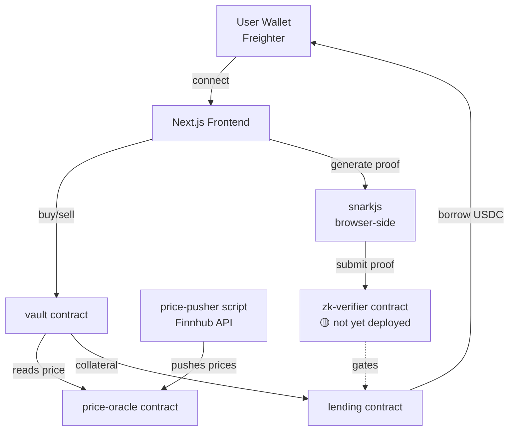

<div align="center">

<!-- Animated typing header (renders live on GitHub via external SVG service) -->


<br/>

<!-- Badges -->


<br/>

**Buy synthetic tokenized stocks on Stellar. Prove your portfolio's health with zero-knowledge proofs.<br/>Never reveal a single holding.**

[Live Demo](#-live-demo) · [Build Status](#-build-status--honesty-first) · [Architecture](#-architecture) · [Setup](#-local-setup) · [Contracts](#-deployed-contracts)

</div>

<br/>


<p align="center"><i>↑ Demo recording to be added — see Build Status below for what's live right now</i></p>

---

## 📌 What is Ztocks?

Ztocks lets users buy **synthetic tokenized stocks** (`AAPLx`, `TSLAx`, `NVDAx`, `GOOGLx`) on Stellar while keeping their portfolio private. Instead of exposing balances on-chain, users generate a **zero-knowledge proof** — e.g. *"my portfolio is worth over $10,000 across 4+ assets"* — and a Soroban smart contract verifies that proof without ever learning the underlying numbers. That proof unlocks USDC lending against the position, with no holding ever disclosed.

Built for the **Stellar Hacks: Real-World ZK** hackathon.

---

## 🚦 Build Status — Honesty First

This hackathon explicitly asked for transparency over polish. Here's exactly what's real, what's simulated, and why.

| Component | Status | Notes |
|---|---|---|
| 🟢 **`price-oracle` contract** | **Deployed + Initialized** | Live on Stellar Testnet |
| 🟢 **`vault` contract** | **Deployed + Initialized** | Live on Stellar Testnet |
| 🟢 **`lending` contract** | **Deployed + Initialized** | Live on Stellar Testnet |
| 🟡 **`zk-verifier` contract** | **Built, not deployed** | Circuit + Rust verifier compile successfully; ran out of time to complete the testnet deployment before submission |
| 🟡 **ZK proof flow (frontend)** | **Simulated** | UI walks through the full Groth16 prove/verify flow end-to-end against mock proof data, since the on-chain verifier isn't live yet |
| 🟢 **Frontend** | **Deployed to Vercel** | Trade, Portfolio, and Lending pages read/write real on-chain state for vault/lending/oracle |
| 🟡 **Live price feed** | **Partial** | Price-pusher script (Finnhub → Soroban) is built; population is in progress |

**Why the ZK verifier isn't deployed:** the Groth16 verifier requires a Powers-of-Tau trusted setup ceremony and a BLS12-381 circuit compile that took significantly longer than budgeted in our environment. The contract itself compiles and the logic is complete — see [`contracts/contracts/zk-verifier`](./contracts/contracts/zk-verifier) — it simply didn't make it through final deployment before the deadline. We'd rather ship 3-of-4 contracts genuinely live than fake a fourth.

---

## 🏗 Architecture



**Stack**

- **Frontend:** Next.js 15, TypeScript, TailwindCSS, Framer Motion
- **Wallet:** Freighter
- **Chain:** Stellar Soroban (Rust smart contracts)
- **ZK:** Circom (BLS12-381) + snarkjs (browser proving) + Groth16 verifier in Rust
- **Oracle:** Custom pushed-price oracle, Finnhub → Soroban

---

## 📜 Deployed Contracts

All contracts live on **Stellar Testnet**.

| Contract | Address | Explorer |
|---|---|---|
| `price-oracle` | `CDODBA324UYHLANYPY7DYXOD74Q4FYGHG2ML3FL3FOKZLI6Z6PAXE7JE` | [View](https://stellar.expert/explorer/testnet/contract/CDODBA324UYHLANYPY7DYXOD74Q4FYGHG2ML3FL3FOKZLI6Z6PAXE7JE) |
| `vault` | `CB7F4OTYEZEQQQUY4XM72LG4BYVAIYAIM4HVL5DFQOF7FHYY4RCC4HVQ` | [View](https://stellar.expert/explorer/testnet/contract/CB7F4OTYEZEQQQUY4XM72LG4BYVAIYAIM4HVL5DFQOF7FHYY4RCC4HVQ) |
| `lending` | `CDM3SGASPH2CYWDPBVRLECYJFMQVJB3PE6MFQCE2L3BYZWQW3HMYKFWD` | [View](https://stellar.expert/explorer/testnet/contract/CDM3SGASPH2CYWDPBVRLECYJFMQVJB3PE6MFQCE2L3BYZWQW3HMYKFWD) |
| `zk-verifier` | *not yet deployed* | — |

---

## 🎬 Live Demo

🔗 **App:** [your-vercel-url-here.vercel.app](#)
🔗 **Repo:** this repository

> Demo video/GIF: _coming soon — placeholder above_

---

## ⚙️ Local Setup

### 1. Contracts (Rust + Stellar CLI)

```bash
cd contracts/contracts/<contract-name>
stellar contract build
stellar contract deploy --wasm target/wasm32v1-none/release/<name>.wasm --source admin --network testnet
```

Full deploy order and dependency notes: [`contracts/README.md`](./contracts/README.md)

### 2. Frontend

```bash
cd frontend
cp .env.example .env.local   # fill in contract IDs above
npm install
npm run dev
```

### 3. Generate contract bindings (after deploying)

```bash
cd frontend
./scripts/generate-bindings.sh
```

### 4. Price feed (optional, requires a Finnhub key)

```bash
cd frontend/scripts/price-pusher
cp .env.example .env   # add your Finnhub key + pusher keypair
npm install && npm run once
```

---

## 🔐 Privacy Model

A user's holdings never leave their browser unencrypted. The flow:

1. User's wallet holds private witness data (their actual token amounts)
2. A Circom circuit proves a *threshold* claim (`portfolio ≥ $10,000`, `assets ≥ 4`) without revealing the amounts
3. snarkjs generates the Groth16 proof client-side
4. The Soroban verifier checks the proof on-chain — pass/fail only, no values disclosed

---

## 🗺 What's Next

- [ ] Complete `zk-verifier` testnet deployment
- [ ] Wire live proof submission end-to-end (currently simulated in UI)
- [ ] Run price-pusher continuously for live quotes
- [ ] Mainnet trusted setup ceremony (current one is single-contributor, testnet-only)

---

<div align="center">

Built for **Stellar Hacks: Real-World ZK** 🌟

</div>
